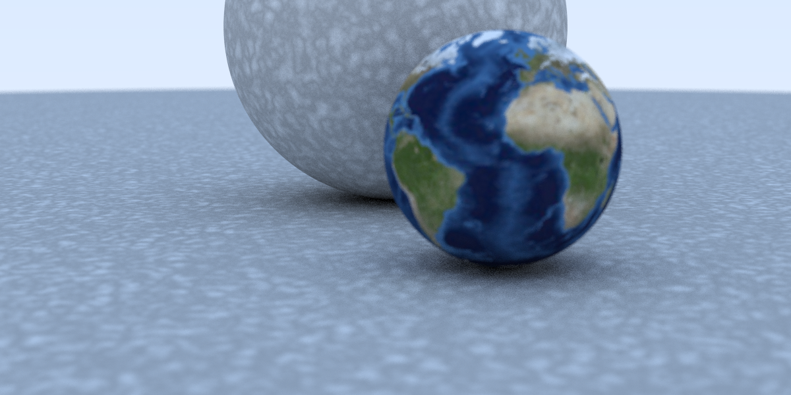

# RayGun (tiny pathtracer)
Pathtracing image renderer done for fun.

Following Pete Shirley's books for now.
Maybe in the future I'll get triangle-based scenes going...

#### Libraries Used:
- [STB Image & Image Write](https://github.com/nothings/stb)

#### Progress:
- [x] Ray Tracing in One Weekend
- [ ] Ray Tracing: the Next Week
- [ ] Ray Tracing: the Rest Of Your Life
- [ ] Wrap and present the image to screen... (it'd be cool to see the pixels being filled in in real-time)
